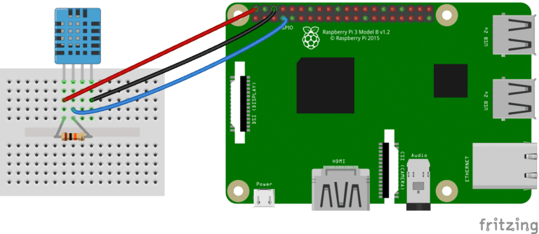

# Android-Things
Lectures and labs for the IoT course (also called Android-Things, like the old platform deprecated by Google)  

## Resources
- [NeuralPi - RaspberryPi guitar pedal using an LSTM model](https://github.com/GuitarML/NeuralPi)
- [Arduino FM Radio](https://www.youtube.com/watch?v=n1hPj2wfsnA)
- [A simple audio amplifier](https://duino4projects.com/simple-audio-amplifier/)
- [RaspberryPi + Arduino Serial Communication](https://roboticsbackend.com/raspberry-pi-arduino-serial-communication/)
- [DHT11 sensor setup on Raspberry Pi](https://www.circuitbasics.com/how-to-set-up-the-dht11-humidity-sensor-on-the-raspberry-pi/)
- [DHT11 Python library](https://github.com/szazo/DHT11_Python)
- [MQTT and sensors](https://www.inzata.com/making-sense-of-iot-sensors-mqtt-and-streaming-data/)

## Ideas

- Puredata-powered guitar pedal with Raspberry Pi, controlled by a simple Android app

	The goal of this project is to create a guitar pedal from a Raspberry Pi, a device which processes the analog signal coming from the guitar and applies an effect on it e.g distortion, fuzz, overdrive, tremolo, echo). The effect produced by the pedal can be controlled by a simple Android app with buttons and knobs.
	To create the sound effect, we can use the visual programming language Puredata.
	In order to connect the guitar to the pedal and the pedal to the amp, we can use a sound card/DAC/ADC such as [Hifiberry DAC+ADC](https://ro.farnell.com/hifiberry/4260439550583/dac-adc-hi-res-dac-adc-for-rpi/dp/3404429)

- Weather monitoring system

	This project collects temperature and humidity data which is displayed on a webpage with graphs containing the values for the variation of these quantities over time. The main goal is to use a DHT11 sensor in a simple circuit and to stream temperature and humidity values with a basic Python script through an MQTT broker created with Mosquitto.

	The components needed are:

		- [Temperature and humidity sensor DHT11](https://www.emag.ro/senzor-de-temperatura-si-umiditate-dht11-arduino-ai051-s37/pd/D9CZ56BBM/)

		- A Raspberry Pi 

			or

		- An Arduino with a WiFi module

		- [RPI GPIO Python module](https://github.com/Tieske/rpi-gpio)

		- [paho.mqtt Python module](https://github.com/eclipse/paho.mqtt.python)

## Setup

## Diagram

The setup contains a single DHT11 sensor which is supposed to obtain the temperature and the humidity of the environment. The VCC pin of the sensor is the power supply pin which is connected to the pin no. 2 on the board. The signal pin is used to obtain the temperature and humidity, while the ground pin of the sensor is connected to the 6th pin (ground) on the board. The third pin of the sensor is unused. In order to limit current, a 4.7K Ohm resistor is placed between the VCC and the signal pin.

To access the Raspberry Pi without a monitor, we can log into the board through SSH. But before that, the board has to be connected to the same LAN as our laptop. To do this, we type the SSID of the router and the required password into a file named "wpa_supplicant.conf" which is going to be saved into the /boot directory of the SD card containing the Raspberry Pi OS installation. Another required step to be able to use SSH is to create an empty file named "ssh" and place it in the /boot directory as well, therefore causing the board to connect to the router automatically each time the board is powered. 

For the Python scripts used to read and stream the sensor data, the RPI.GPIO module is responsible for obtaining the sensor values, while the paho.mqtt module sends/receives messages containing the sensor values to/from a Mosquitto MQTT broker installed locally on the Raspberry Pi (hence the 127.0.0.1 IP for the broker address in the script). The main idea of MQTT is that we have publishers who "publish" data and subscribers which "subscribe" to the topics to which the publishers send data. This is done in real time, almost instantaneously.

A next step would be to create a small Angular project and a plot with Plotly which would display the values visually. To subscribe to the stream of data coming from the Python script through the broker, one could use Observables. 

